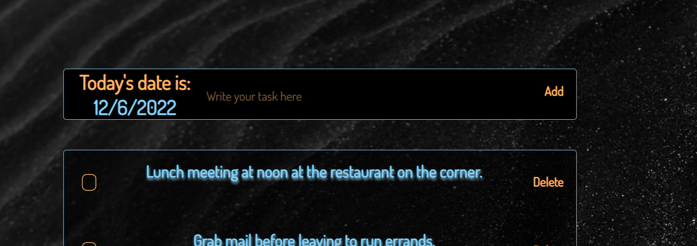

# tASKtRACK
A calming take on a to-do list, tASKtRACK makes creating a list simple and easy to do by having minimal features that aren't necessary to create a list for your daily adventures. Although this app was created in under a week, the aesthetic appeal should feel welcoming to anyone who gets a little anxious when planning out all of their tasks for the day.

tASKtRACK was create by Noah Cain. Noah enjoys building simple, user-apps that take the guesswork out of where to go next, while providing detailed, and to-the-point functionality that is easy to use by anyone. This app is still a work in progress, with more features to come. The end goal is to keep it simplistic while making sure it is not lacking any details that a user would like to see.

## Table of Contents
* [Technologies Used](#technologiesused)
* [Dependencies Used](#dependenciesused)
* [How to use](#use)

## Technologies Used

* Javascript
* HTML5
* CSS3

## Dependencies Used

* Axios
* CORS
* Express
* Nodemon

## How to use

### Enter a task in the field at the top of the page
Once a task has been typed in to the field, the task can be submitted to the task list by either clicking the 'Add' button, or by simply pressing the 'Enter' key on the keyboard.

### Update tasks by clicking the checkbox to the left of the task
This will help to sort out the tasks that have been completed against the tasks that have yet to be completed.

### Delete the task from the database
Once the task is no longer needed to be displayed, it can be deleted by clicking the 'Delete' button to the right of the task.

### Date tracker
The date is automatically updated based on the time zone the computer is currently in.

## Author
Noah Cain is an aspiring software engineer in Liberty Lake, WA